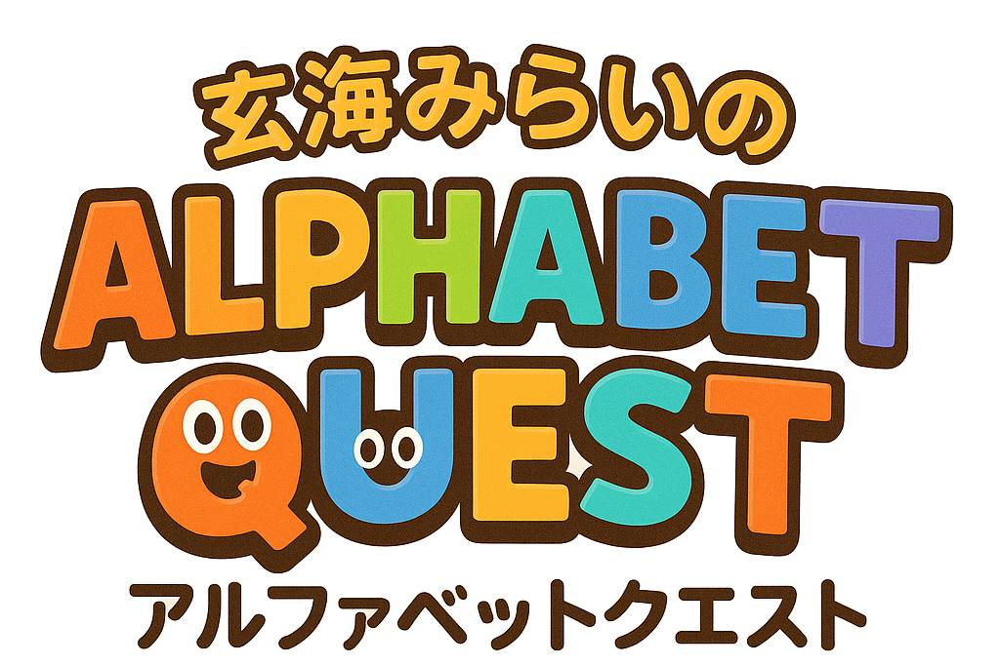
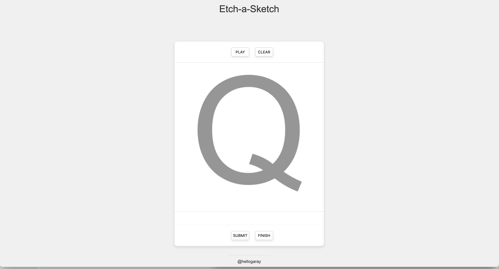

  
  

    
    
    
  

  
  
  

Browser game to help kids practice writing the alphabet by tracing letters with visual feedback.

## Description

**Alphabet Quest** is a fun browser game designed for middle schoolers in Japan to practice writing the English alphabet. Players trace uppercase and lowercase letters with real-time visual feedback and receive a cute hanamaru-style grade after each try.

## Features

- 🎨 **Interactive Drawing Canvas** – Kids can trace letters using a brush that reacts to color-coded feedback zones.
- 🔤 **Random Letters A–Z and a–z** – Each round presents a randomly chosen letter in either uppercase or lowercase.
- ✨ **Real-time Feedback** – Smart color tracking encourages correct tracing technique.
- 🌸 **Hanamaru Grading** – After tracing, kids receive one of four fun stamps with encouraging messages:
  - 💮 **Super Hanamaru** – Perfect!
  - 🌼 **Great Hanamaru** – Almost perfect!
  - ✿ **Nice Hanamaru** – Good effort!
  - ❌ **Try Again Hanamaru** – Keep trying!
- 🎯 **Final Score Calculation** – At the end, kids can view their average performance and restart the practice.

## How to Play

1. **Click "Play"** to start a new letter challenge.
2. **Trace the letter** on the canvas using your mouse or touchpad.
   - Correct zones will respond in **blue (Berkeley Blue)**.
   - Mistakes or off-target lines will register as **red (Pantone Red)**.
3. **Click "Finish"** to see your average score across all attempts.
4. **Click "Clear"** to reset the canvas and try the current letter again.

Players are graded visually with cute hanamaru emojis and messages after every attempt—making learning joyful and stress-free!

## Installation

No installation is required to play **Alphabet Quest**!  
Just open the `index.html` file in your web browser and start tracing!

## Original Version

  

## Final Version

  

